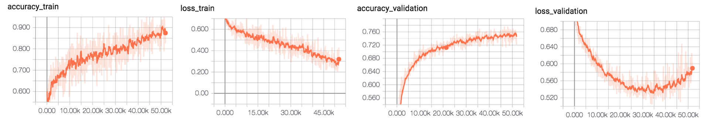
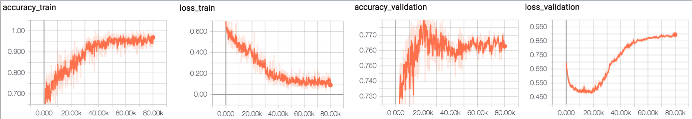
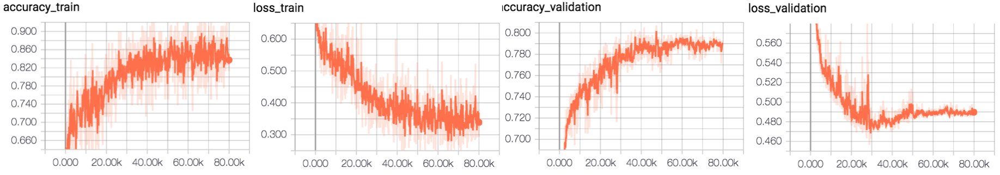
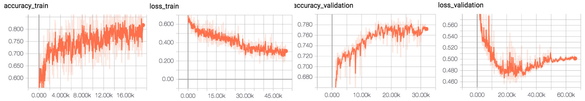
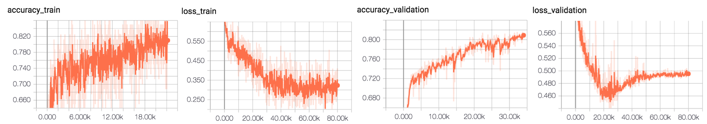
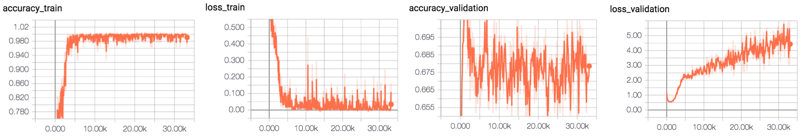
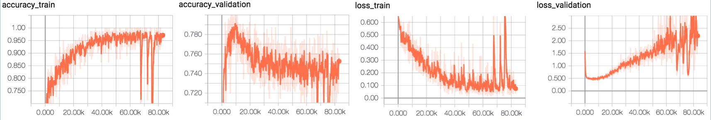
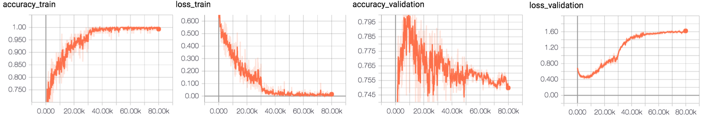

# Alexnet

## Fundus Classification 

conv_out_features=[32,64,64,64,128] | conv_kernel_sizes=[7,5,5,3,3] | conv_strides=[2,2,2,1,1]

allow_max_pool_indices=[0,1,4]

before_act_bn_mode = [] after_act_bn_mode = []

fc_out_features = [1024,1024]

Batch Size 80 

Data Normal 3000 | glaucoma 1000 , retina 1000 , cataract 1000 | Label : single Label 

# Momentum Optimizer

#### Nesterov | learning rate 0.001 | L2_loss | Augmentation No | 
[show more experiment](https://github.com/SoulDuck/Alexnet/blob/master/experiment/momentum/result_0.md)

max accuracy :79%

#### Nesterov | learning rate 0.001 | L2_loss | Augmentation Yes(No random crop)
[show more experiment](https://github.com/SoulDuck/Alexnet/blob/master/experiment/momentum/result_1.md)

max accuracy :79%

#### Nesterov | learning rate 0.001 | L2_loss | Augmentation Yes(No random crop)

##### No Fully connected used , using Global Average Pooling to get Logits

[show more experiment](https://github.com/SoulDuck/Alexnet/blob/master/experiment/momentum/result_2.md)

max accuracy :81%

#### Nesterov | learning rate 0.001 | L2_loss | Augmentation Yes(with random crop)
[show more experiment](https://github.com/SoulDuck/Alexnet/blob/master/experiment/momentum/result_3.md)

max accuracy :79.4%

#### Nesterov | learning rate 0.001 | L2_loss | Augmentation Yes(with random crop)

##### No Fully connected used , using Global Average Pooling to get Logits

[show more experiment](https://github.com/SoulDuck/Alexnet/blob/master/experiment/momentum/result_4.md)

max accuracy :81%

# ADAM Optimizer 

#### learning rate 0.001 | L2_loss X | Augmentation No
[show_more_experiment](https://github.com/SoulDuck/Alexnet/blob/master/experiment/Adam/result_0.md)

accuracy 75%

#### learning rate 0.001 | L2_loss X | Augmentation Yes (No random crop)
[show_more_experiment](https://github.com/SoulDuck/Alexnet/blob/master/experiment/Adam/result_1.md)
 
accuracy 81%

#### learning rate 0.001 | L2_loss X | Augmentation Yes (No random crop)
[show_more_experiment](https://github.com/SoulDuck/Alexnet/blob/master/experiment/Adam/result_2.md)
### No Fully connected used , using Global Average Pooling to get Logits

accuracy 81%

