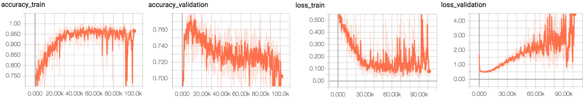

# Alexnet

## Fundus Classification 

conv_out_features=[32,64,64,64,128]

conv_kernel_sizes=[7,5,5,3,3]

conv_strides=[2,2,2,1,1]

before_act_bn_mode = []

after_act_bn_mode = []

fc_out_features = [1024,1024]

Batch Size 80 

Data Normal 3000 | glaucoma 1000 , retina 1000 , cataract 1000

Label : single Label 

allow_max_pool_indices=[0,1,4]

#### Optimizer = Momentum Optimizer | Nesterov | learning rate 0.001 | L2_loss | Augmentation No

[show more experiment](https://github.com/SoulDuck/Alexnet/blob/master/experiment/momentum/fundus_0_2_result.md)

max accuracy :79%

#### Optimizer ADAM | learning rate 0.001 | L2_loss X | Augmentation No

[show_more_experiment](https://github.com/SoulDuck/Alexnet/blob/master/experiment/Adam/fundus_0_2_result.md)

#### Optimizer ADAM | learning rate 0.001 | L2_loss X | Augmentation Yes 

accuracy 81%

accuracy 78%

