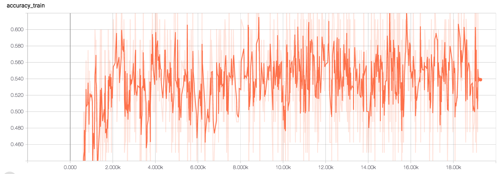
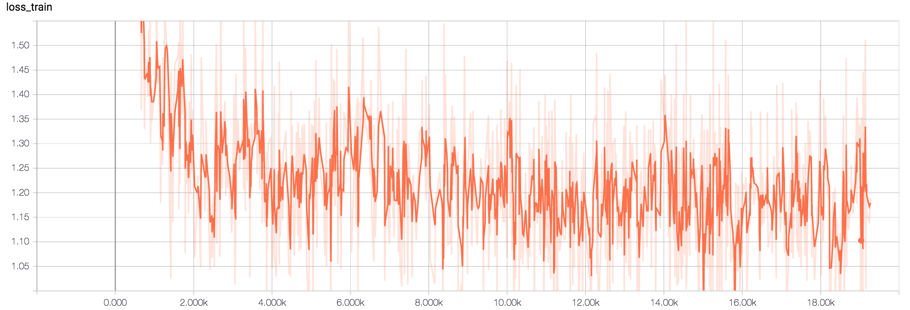
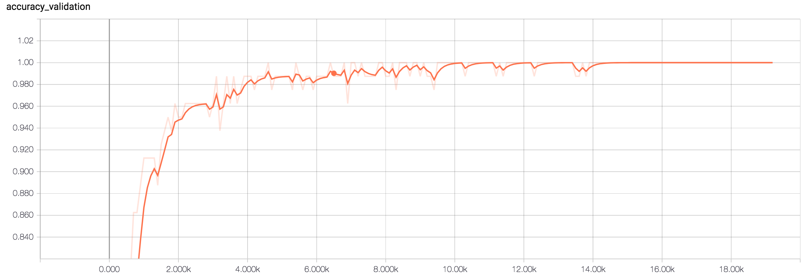
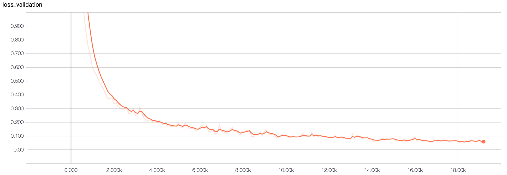

# Alexnet
result 1 
conv_out_features=[16,16,16,16,16]

conv_kernel_sizes=[5,5,5,3,3]

conv_strides=[1,1,1,1,1]

before_act_bn_mode = []

after_act_bn_mode = []

allow_max_pool_indices=[0,1,4]

dropout cnn --> None 

fc_out_features = [1024,1024, n_classes]  

dropout fc layer = 0.5 

optimizer Momentum with nesterov

Loss = L2_loss * weight_decay(=0.9) + cross_entropy

MNIST :0.99 | Fundus : No learning , same validation loss , and accuracy 

## Fundus Classification 

conv_out_features=[32,64,64,64,128]

conv_kernel_sizes=[7,5,5,3,3]

conv_strides=[2,2,2,1,1]

before_act_bn_mode = []

after_act_bn_mode = []

fc_out_features = [1024,1024]

Optimizer = GradientDescentOptimizer | learning rate 0.001 | L2_loss X

Batch Size 80 

Data Normal 3000 | glaucoma 1000 , retina 1000 , cataract 1000

Label : single Label 

allow_max_pool_indices=[0,1,4]
