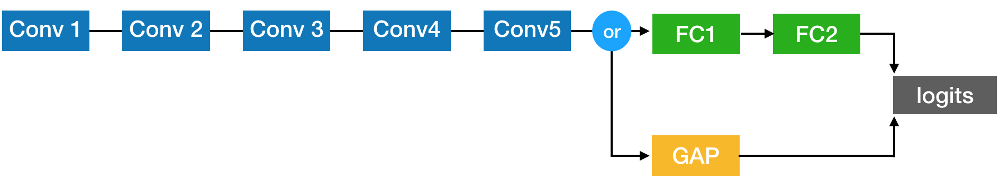

# Alexnet

## structure 

## Fundus Classification 

conv_out_features=[32,64,64,64,128] | conv_kernel_sizes=[7,5,5,3,3] | conv_strides=[2,2,2,1,1]

allow_max_pool_indices=[0,1,4]

before_act_bn_mode = [] after_act_bn_mode = []

fc_out_features = [1024,1024]

Batch Size 80 

Data Normal 3000 | glaucoma 1000 , retina 1000 , cataract 1000 | Label : single Label 

|Optimizer| augmentation | random crop | L2 loss | Fc or gap | batch norm | acc | loss | learningRate |
| --- | --- | --- | --- | --- | --- | --- |--- |--- |
| SGD | X | X | X | FC | X |   [80.1%](readme_pic/0/alex_experiment_0.md) | [0.455](alex_experiment_0.md) | |
| SGD | O | X | X | FC | X |   [81.07%](readme_pic/1/alex_experiment_1.md) | [0.46](readme_pic/1/alex_experiment_1.md) | |
| SGD | O | O | X | FC | X |   [81.25%](readme_pic/2/alex_experiment_2.md) | [0.43](readme_pic/2/alex_experiment_2.md) | |
| SGD | O | O | X | GAP| X |   [80.08%](readme_pic/3/alex_experiment_3.md) | [0.44](readme_pic/3/alex_experiment_3.md) | |
| SGD | O | O | X | GAP | X |  [80.00%](readme_pic/4/alex_experiment_4.md) | [0.46](readme_pic/4/alex_experiment_4.md) | |
| SGD | O | O | X | GAP | X |  [80.08%](readme_pic/5/alex_experiment_5.md) | [0.47](readme_pic/5/alex_experiment_5.md) | |
| SGD | X | X | O | FC | X |   [82.14%](readme_pic/6/alex_experiment_6.md) | [0.44](readme_pic/6/alex_experiment_6.md) | |
| SGD | O | X | O | FC | X |   [82.50%](readme_pic/7/alex_experiment_7.md) | [0.44](readme_pic/7/alex_experiment_7.md) | |

|Optimizer| augmentation | random crop | L2 loss | Fc or gap | batch norm | acc | loss |  learningRate |
| --- | --- | --- | --- | --- | --- | --- |--- |--- |
| SGD | O | O | X | FC | X | 79.46% | 0.47 | | 
| SGD | O | O | X | GAP | X | 81.07% | 0.43 |  |
| Momentum+ | O | O | X | FC | X | 78.57% | 0.47 | | 
| Momentum+ | O | O | X | GAP | X | ? | ? | | 
| Adam | O | O | X | FC | X | ? | ? | | 
| Adam | O | O | X | GAP | X | ? | ? | | 

| Momentum+ | O | O | X | FC | X | 78.57 | 0.47 |
학습이 안된 이유는 epoch을 너무 적게 잡았다.

| Adam | O | O | X | FC | X | ? | ? | 
learning rate 을 조정해야 햔다 .
