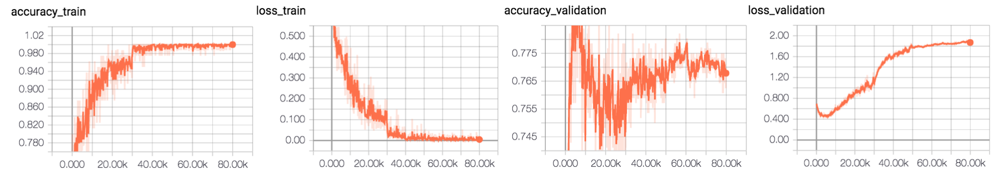

conv_out_features=[32,64,64,64,128]

conv_kernel_sizes=[7,5,5,3,3]

conv_strides=[2,2,2,1,1]

before_act_bn_mode = []

after_act_bn_mode = []

fc_out_features = [1024,1024]

Batch Size 80

Data Normal 3000 | glaucoma 1000 , retina 1000 , cataract 1000

Label : single Label

allow_max_pool_indices=[0,1,4]

# ADAM Optimizer 
##### learning rate 0.001 | L2_loss | Augmentation Yes (with random crop)

