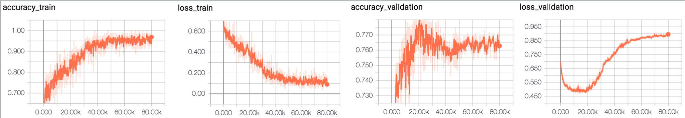
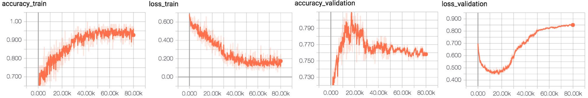
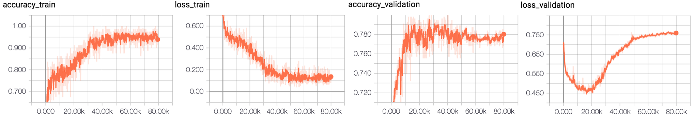

# fundus result 

conv_out_features=[32,64,64,64,128] | conv_kernel_sizes=[7,5,5,3,3] | conv_strides=[2,2,2,1,1]

allow_max_pool_indices=[0,1,4]

before_act_bn_mode = [] after_act_bn_mode = []

fc_out_features = [1024,1024]

Batch Size 80

Data Normal 3000 | glaucoma 1000 , retina 1000 , cataract 1000 | Label : single Label

Optimizer = Momentum Optimizer | Nesterov | learning rate 0.001 | L2_loss | Augmentation yes

