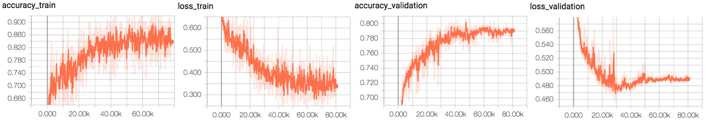
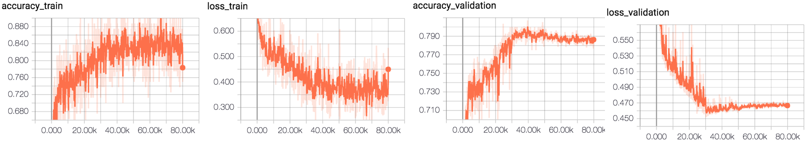
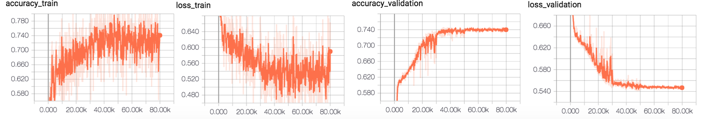
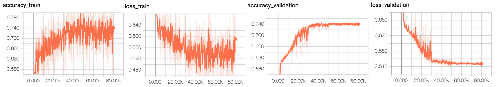
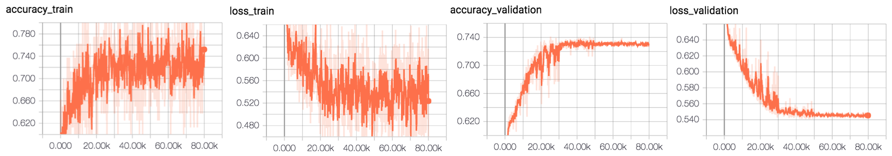
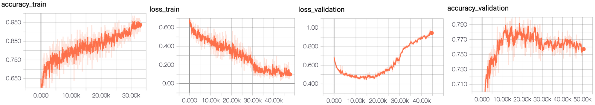
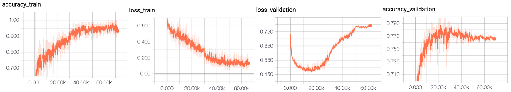
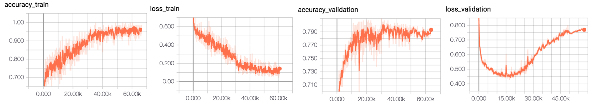
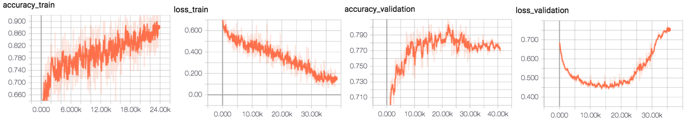

# Alexnet

## Fundus Classification 

conv_out_features=[32,64,64,64,128] | conv_kernel_sizes=[7,5,5,3,3] | conv_strides=[2,2,2,1,1]

allow_max_pool_indices=[0,1,4]

before_act_bn_mode = [] after_act_bn_mode = []

fc_out_features = [1024,1024]

Batch Size 80 

Data Normal 3000 | glaucoma 1000 , retina 1000 , cataract 1000 | Label : single Label 

# SGD optimizer 

#### learning rate 0.001 | L2_loss | Augmentation Yes

0.001 (step < 30000 ) ---> 0.0001 (step < 50000)  ---> 0.0001 (step < 80000 )

3번 , 4번 그래프의 양상이 다른 그래프와 다른 이유는 
학습이 덜 된 상태에서 learning rate 가 줄어들었기 때문이다.
learning rate 조정해야 한다.

